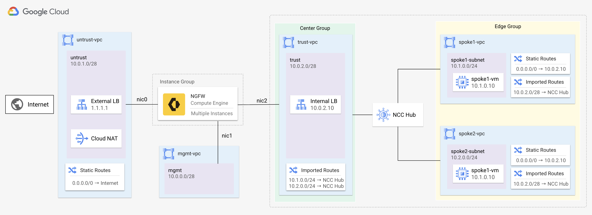
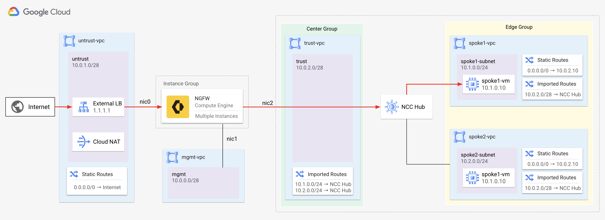
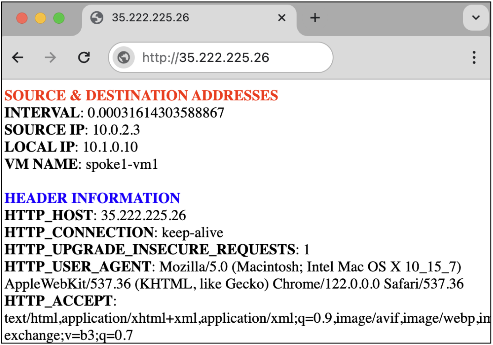
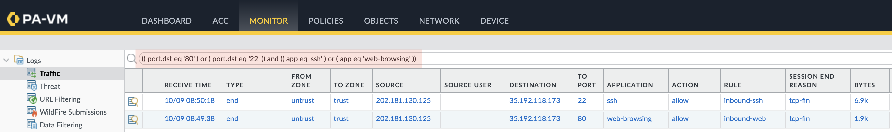
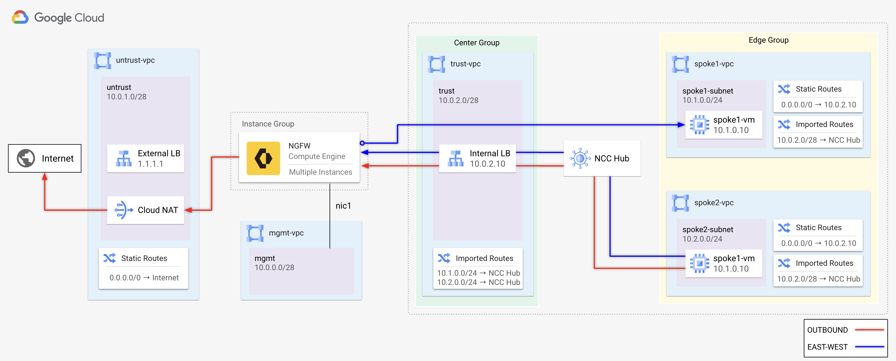
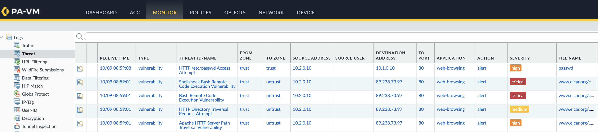

# Google Cloud NCC & VM-Series Tutorial

This tutorial shows how to use the [Network Connectivity Center](https://cloud.google.com/network-connectivity/docs/network-connectivity-center/concepts/overview) star topology with Palo Alto Networks VM-Series firewalls. This solution supports the following use-cases:

* Secure internet inbound and outbound traffic to edge VPC networks. 
* Secure east-west traffic between edge VPC networks.
* Secure Cloud VPN traffic to edge VPC networks. 

> [!NOTE]
> Please see [comparison to VPC Network Peering](https://cloud.google.com/network-connectivity/docs/network-connectivity-center/concepts/vpc-spokes-overview#vpc-peering-vs-vpc-spokes) for a comparison to VPC Network Peering. 

> [!IMPORTANT]
>To connect the VM-Series as a **Router Appliance** using BGP, see [VM-Series as a Router Appliance (BGP)](bgp_tutorial/README.md).

This tutorial is intended for network administrators, solution architects, and security professionals who are familiar with [Compute Engine](https://cloud.google.com/compute) and [Virtual Private Cloud (VPC) networking](https://cloud.google.com/vpc).

## Architecture
The star topology uses two spoke groups with separate route tables to enforce segmentation.  All networks belonging to a spoke group are connected to an NCC hub.

- **Center group:** Allows traffic between center spokes and between center and edge spokes.  
- **Edge group:** Allows traffic only to center spokes; direct edge-to-edge communication is blocked.

The VM-Series `trust-vpc` belongs to the **center group**, while the protected networks, `spoke1-vpc` and `spoke2-vpc` belong to the **edge group**. All ingress and egress traffic from edge networks is routed through the center group, where it is inspected by the VM-Series firewall.



For more information please see [Network Connectivity Center Star Topology](https://cloud.google.com/network-connectivity/docs/network-connectivity-center/concepts/connectivity-topologies#star-topology).

## Requirements

The following is required for this tutorial:

1. A Google Cloud project. 
2. A machine with Terraform version:`>= 1.6.0`

> [!NOTE]
> This tutorial assumes you are using Google Cloud Shell. 


## Prepare for Deployment

1. Enable the required APIs and clone the repository. 

    ```
    gcloud services enable compute.googleapis.com
    git clone https://github.com/PaloAltoNetworks/google-cloud-ncc-tutorial
    cd google-cloud-ncc-tutorial
    ```

2. Generate an SSH key.

    ```
    ssh-keygen -f ~/.ssh/vmseries-tutorial -t rsa
    ```

3. Create a `terraform.tfvars` file.

    ```
    cp terraform.tfvars.example terraform.tfvars
    ```

4. Edit the `terraform.tfvars` file and set values for the following variables:

    | Key                    | Value                                                                   | 
    | ---------------------- | ----------------------------------------------------------------------- |
    | `project_id`           | The Project ID within Google Cloud.                                     |
    | `public_key_path` | The local path of the public key you previously created                 |
    | `vmseries_mgmt_ips`        | A list of IPv4 addresses which require access to the VM-Series MGT NIC. |
    | `vmseries_image`           | The VM-Series image to deploy.                                          |
    | `configure_ncc`        | If `true`, create the NCC hub, center, and edge groups.                     | 

> [!TIP]
> For `vmseries_image_name`, a full list of public images can be found using `gcloud`:
> ```
> gcloud compute images list --project paloaltonetworksgcp-public --filter='name ~ .*vmseries-flex.*'
> ```

> [!NOTE]
> If you are using BYOL image (i.e. `vmseries-flex-byol-*`), the license can be applied during or after deployment.  To license during deployment, add your VM-Series Authcodes to `bootstrap_files/authcodes`. <br><br>See [VM-Series Bootstrap Methods](https://docs.paloaltonetworks.com/vm-series/11-1/vm-series-deployment/bootstrap-the-vm-series-firewall) for more information.


### Deploy

When no further changes are necessary in the configuration, deploy the resources.

1. Initialize and apply the Terraform plan.  

    ```
    terraform init
    terraform apply
    ```

    Enter `yes` to create the resources.

2. After all the resources are created, Terraform displays the following message:

    <pre>
    Apply complete!

    Outputs:

    EXTERNAL_LB_IP = <b>"35.192.118.173"</b></pre>

### Verify NCC Star Topology

1. In Cloud Shell, create an environment variable to represent your Project ID. 
    
    <pre>
    export PROJECT_ID=<b><i>YOUR_PROJECT_ID</i></b></pre> 

2. Retrieve the name of your NCC hub. 

    ```
    export HUB_NAME=$(gcloud network-connectivity hubs list \
        --project=$PROJECT_ID \
        --format="value(name)")
    ```

2. list the spokes and verify that `spoke1-vpc`, `spoke2-vpc`, and the `trust-vpc` are onboarded to the NCC hub. 

    ```
    gcloud network-connectivity hubs list-spokes $HUB_NAME \
        --project=$PROJECT_ID \
        --format='table(name,group,spokeType,state)'
    ```

    (output)
    <pre>
    <b>NAME    GROUP   TYPE         STATE</b>
    spoke1  edge    VPC_NETWORK  ACTIVE
    spoke2  edge    VPC_NETWORK  ACTIVE
    trust   center  VPC_NETWORK  ACTIVE</pre>

> [!IMPORTANT]
> Ensure that both `spoke1-vpc` and `spoke2-vpc` are assigned to the **EDGE** group, and the `trust-vpc` is assigned to the **CENTER** group. All spokes must show **state**=`ACTIVE`.


## Access the Firewall

To access the VM-Series's user interface, a password must be set for the `admin` user.

> [!CAUTION]
> It may take an additional 10 minutes for the firewalls to become fully available. 

1. Retrieve the `EXTERNAL_IP` attached to the VM-Series MGT interface (`NIC1`).

    ```
    gcloud compute instances list \
        --filter='tags.items=(vmseries-tutorial)' \
        --format='value(EXTERNAL_IP)'
    ```

2. SSH to the VM-Series using the `EXTERNAL_IP` with your private SSH key. 

    <pre>
    ssh admin@<b><i>EXTERNAL_IP</i></b> -i ~/.ssh/vmseries-tutorial</pre>

3. On the VM-Series, set a password for the `admin` username. 

    ```
    configure
    set mgt-config users admin password
    ```

4. Commit the changes.
    ```
    commit
    ```

5. Enter `exit` twice to terminate the session.

6. Access the VM-Series web interface using a web browser.  Login with the `admin` user and password.

    <pre>
    https://<b><i>EXTERNAL_IP</i></b></pre>


## Internet inbound traffic

Test inbound internet traffic by accessing the forwarding rule on the external load balancer. Traffic received by the load balancer is forwarded to the VM-Seriess for inspection. If the VM-Series permits the traffic, it performs source NAT to its trust interface (for synchronous response) and destination NAT to the target application in the spoke VPC network.



> [!IMPORTANT]
> The spoke VMs in this tutorial are configured with Jenkins and a generic web service.

1. Open a HTTP connection to the web service on `spoke1-vm1` by copying the `EXTERNAL_LB_IP` output value into a web browser.
    > You can retrieve the `EXTERNAL_LB_IP` by entering `terraform output` in Cloud Shell. 

    <pre>
    http://<b><i>EXTERNAL_LB_IP</i></b></pre>

    


1. Open an SSH session with `spoke2-vm1` using the `EXTERNAL_LB_IP` output value.  

    <pre>
    ssh paloalto@<b><i>EXTERNAL_LB_IP</i></b> -i ~/.ssh/vmseries-tutorial</pre>

3.  On the VM-Series, go to **Monitor → Traffic**.

4.  Enter the following into the log filter to view your internet inbound traffic.

    ```
    (( port.dst eq '80' ) or ( port.dst eq '22' )) and (( app eq 'ssh' ) or ( app eq 'web-browsing' ))
    ```
    
     

> ![NOTE]
> The external load balancer distributes the HTTP & SSH request to the VM-Series.  The VM-Series inspects and translates HTTP traffic to `spoke1-vm1` and SSH traffic to `spoke2-vm1`.


### Internet outbound & east/west traffic 

In an NCC star topology, protected workloads reside in **edge VPCs**, and the VM-Series is deployed in the **center VPC**, which serves as its `trust-vpc`. The NCC hub shares routes with the edge spokes so they forward all traffic to the center for inspection, using the VM-Series internal load balancer as the next hop.




2. From `spoke2-vm1`, test **outbound internet** inspection by generating pseudo malicious traffic to the internet.

    ```
    curl -s -o /dev/null -w "%{http_code}\n" http://www.eicar.org/cgi-bin/.%2e/.%2e/.%2e/.%2e/bin/sh --data "echo Content-Type: text/plain; echo; uname -a" --max-time 2
    curl -s -o /dev/null -w "%{http_code}\n" http://www.eicar.org/cgi-bin/user.sh -H "FakeHeader:() { :; }; echo Content-Type: text/html; echo ; /bin/uname -a" --max-time 2
    ```


3. Test **east-west** inspection by generating pseudo malicious traffic between `spoke2-vm1` and `spoke1-vm1`.

    ```
    curl http://10.1.0.10/cgi-bin/../../../..//bin/cat%20/etc/passwd
    ```

4. On the VM-Series, go to **Monitor → Threat** to view the threat logs.  

     

> [!TIP]
> The security policies enable you to allow or block traffic based on the user, application, and device.  When traffic matches an allow rule, the security profiles that are attached to the rule provide further content inspection. See [Cloud-Delivered Security Services](https://www.paloaltonetworks.com/network-security/security-subscriptions) for more information.


## Clean up

Delete all the resources when you no longer need them.

1. Run the following command
    
    ```
    terraform destroy
    ```

2. At the prompt to perform the actions, enter `yes`. 
   
   After all the resources are deleted, Terraform displays the following message:

    ```
    Destroy complete!
    ```

## Additional information

* Learn about the[ VM-Series on Google Cloud](https://docs.paloaltonetworks.com/vm-series/10-2/vm-series-deployment/set-up-the-vm-series-firewall-on-google-cloud-platform/about-the-vm-series-firewall-on-google-cloud-platform).
* Getting started with [Palo Alto Networks PAN-OS](https://docs.paloaltonetworks.com/pan-os). 
* Read about [securing Google Cloud Networks with the VM-Series](https://cloud.google.com/architecture/partners/palo-alto-networks-vmseries).
* Learn about [VM-Series licensing on all platforms](https://docs.paloaltonetworks.com/vm-series/10-2/vm-series-deployment/license-the-vm-series-firewall/vm-series-firewall-licensing.html#id8fea514c-0d85-457f-b53c-d6d6193df07c).
* Use the [VM-Series Terraform modules for Google Cloud](https://registry.terraform.io/modules/PaloAltoNetworks/vmseries-modules/google/latest). 